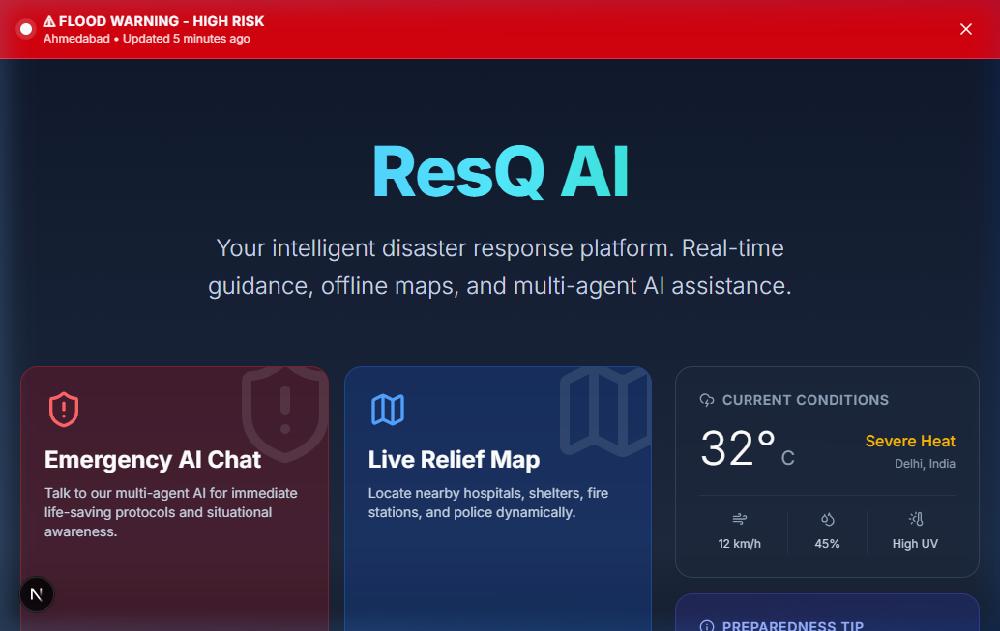
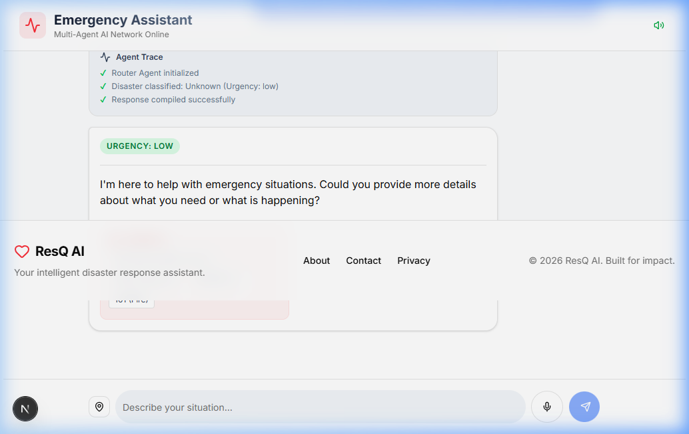
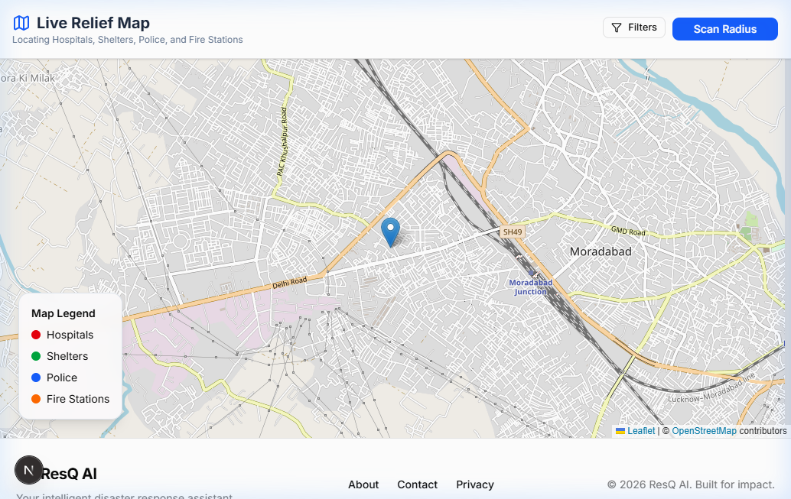
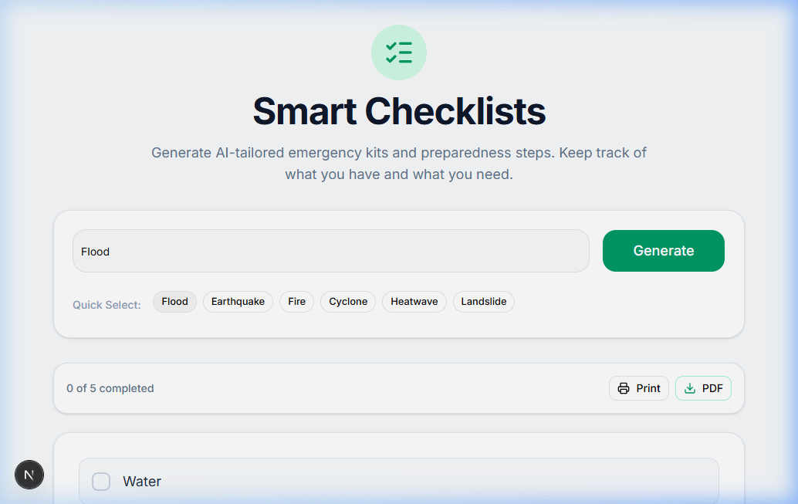
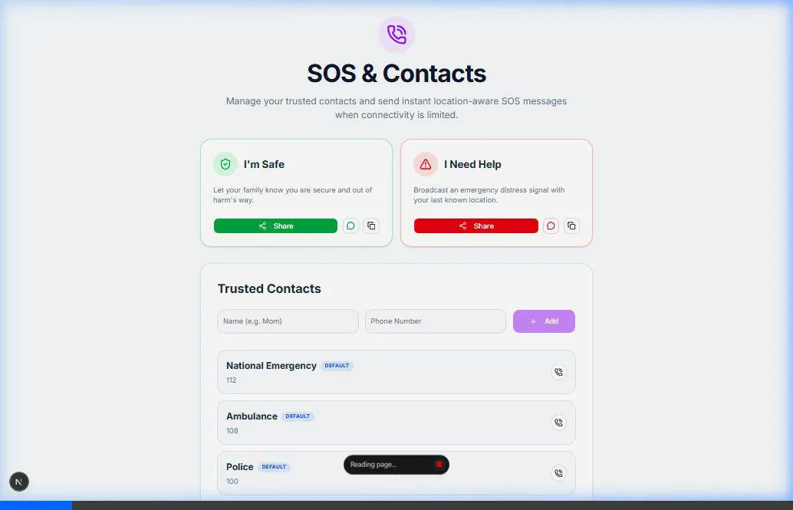
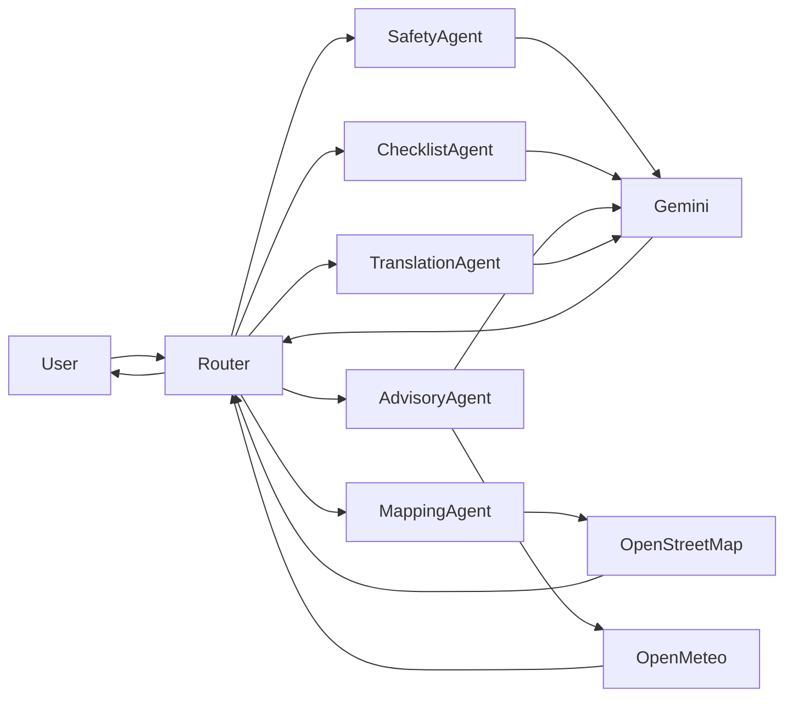
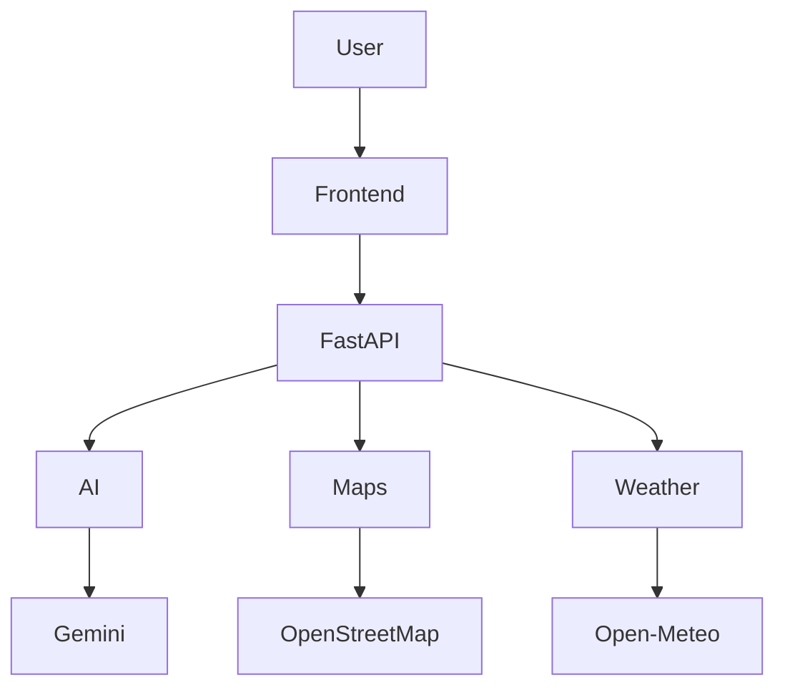
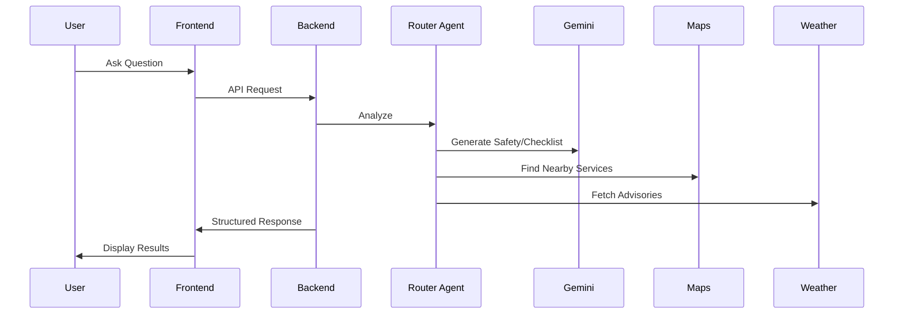

<div align="center">
  <h1>ResQ AI</h1>
  <p><em>AI-Powered Disaster Response Platform</em></p>

  
  
  
  
  
  
  
</div>

<br />

## 📸 Project Preview







## 🎥 Demo GIF


---

## 📖 Table of Contents
- [Project Preview](#-project-preview)
- [Overview](#-overview)
- [Why ResQ AI](#-why-resq-ai)
- [Features](#-features)
- [Application Workflow](#-application-workflow)
- [Multi-Agent Workflow](#-multi-agent-workflow)
- [System Architecture](#-system-architecture)
- [API Request Flow](#-api-request-flow)
- [Tech Stack](#-tech-stack)
- [Folder Structure](#-folder-structure)
- [Environment Variables](#-environment-variables)
- [Installation](#-installation)
- [API Endpoints](#-api-endpoints)
- [Deployment](#-deployment)
- [Security](#-security)
- [Demo](#-demo)
- [Roadmap](#-roadmap)
- [Contributing](#-contributing)
- [Acknowledgements](#-acknowledgements)
- [License](#-license)

---

## 🌍 Overview
**ResQ AI** is a state-of-the-art, AI-powered disaster response assistant designed to help users before, during, and after natural disasters. Built for rapid deployment and accessibility, the platform uses an intelligent multi-agent backend to provide immediate safety guidance, locate nearby emergency services, and generate dynamic survival checklists.

---

## ❓ Why ResQ AI
During natural disasters, individuals face immense challenges:
- **Misinformation & Panic**: Unreliable data leads to dangerous decisions.
- **Delayed Assistance**: Locating the nearest hospital, shelter, or police station during a crisis is often difficult.
- **Multilingual Barriers**: Non-native speakers often struggle to understand critical emergency broadcasts.
- **Lack of Centralized Guidance**: Information is scattered across weather apps, news stations, and social media.

**ResQ AI** solves these issues by offering a centralized, AI-driven emergency dashboard that autonomously coordinates weather data, relief maps, and customized survival instructions in real-time.

---

## 🚀 Features
- **Multi-Agent Emergency Dashboard**: A modern, glassmorphic UI with micro-animations offering mock live alerts and dynamic weather data.
- **AI Emergency Chat (Agent Visualizer)**: Conversational interface that analyzes urgency and disaster types, featuring an animated "Agent Trace" that visualizes the AI's internal logic.
- **Multilingual Voice Support**: Integrated STT (Browser Web Speech API) and TTS (Browser SpeechSynthesis API) for accessibility.
- **Live Relief Map**: Interactive map displaying 100% free location data for Hospitals, Shelters, Police Stations, and Fire Stations.
- **Smart Interactive Checklists**: AI-tailored disaster packing lists with PDF export and printing capabilities.
- **SOS Contacts Manager**: Save trusted contacts locally and quickly share pre-built distress messages appended with GPS coordinates via WhatsApp or Web Share APIs.

---

## 🔄 Application Workflow

User opens website
↓
Chooses emergency feature
↓
AI receives request
↓
Router Agent analyzes
↓
Specialized agents execute
↓
AI generates response
↓
Emergency advice displayed
↓
Map updated
↓
Voice response (if enabled)

---

## 🤖 Multi-Agent Workflow

Our backend leverages a synchronized swarm of AI agents to handle crisis data.



### AI Agent Descriptions
- **Router Agent**: Determines request type, parses intent, and orchestrates other agents to compile the final structured response.
- **Safety Agent**: Generates immediate, emergency guidance and survival protocols.
- **Mapping Agent**: Finds nearby hospitals, shelters, police, and fire stations via OpenStreetMap.
- **Checklist Agent**: Generates preparedness checklists tailored to specific disaster types.
- **Advisory Agent**: Processes live disaster advisories and summarizes complex weather data.
- **Translation Agent**: Translates emergency responses into the user's native language.

---

## 🧠 System Architecture



---

## ⚡ API Request Flow



---

## 🛠 Tech Stack

| Layer | Technology |
|-------|------------|
| Frontend | Next.js, React |
| Backend | FastAPI, Python, Uvicorn |
| AI | Google Gemini Free API |
| Maps | Leaflet, React-Leaflet, OpenStreetMap, Overpass API |
| Weather | Open-Meteo |
| Database | LocalStorage |
| Styling | TailwindCSS, shadcn/ui |
| Animations | Framer Motion |

---

## 📂 Folder Structure
```text
resq-ai/
├── backend/          # FastAPI Python backend (Agents, Endpoints)
├── frontend/         # Next.js 15 React frontend (UI, Pages, Components)
├── docs/             # Visual documentation and diagrams
├── README.md         # Project documentation
├── PROJECT.md        # Project setup guidelines
└── .gitignore        # Git ignore rules
```

---

## 🔐 Environment Variables
Never commit these files to version control. Use `.env.example` as a template.

### Backend (`backend/.env`)
```env
GEMINI_API_KEY=your_gemini_api_key_here
```

### Frontend (`frontend/.env.local`)
```env
NEXT_PUBLIC_API_URL=http://localhost:8000
```

---

## 🏃 Installation

### Prerequisites
- Node.js (v18+)
- Python (3.11+)
- Git

### Backend Setup
1. Clone the repository and navigate to the backend:
   ```bash
   git clone https://github.com/Mayank-thakur21/resq-ai.git
   cd resq-ai/backend
   ```
2. Create and activate a virtual environment:
   ```bash
   # Windows
   python -m venv venv
   .\venv\Scripts\Activate

   # macOS/Linux
   python3 -m venv venv
   source venv/bin/activate
   ```
3. Install dependencies:
   ```bash
   pip install -r requirements.txt
   ```
4. Copy the environment variables:
   ```bash
   cp .env.example .env
   ```
5. Get a [Free Google Gemini API Key](https://aistudio.google.com/) and paste it into `backend/.env`.
6. Run the development server:
   ```bash
   uvicorn app.main:app --reload
   ```
   *(Server runs on `http://localhost:8000`)*

### Frontend Setup
1. Open a new terminal and navigate to the frontend:
   ```bash
   cd resq-ai/frontend
   ```
2. Install dependencies:
   ```bash
   npm install
   ```
3. Copy the environment variables:
   ```bash
   cp .env.example .env.local
   ```
4. Run the development server:
   ```bash
   npm run dev
   ```
5. Open `http://localhost:3000` in your browser.

---

## 🔌 API Endpoints
The backend exposes the following RESTful endpoints:

- `GET /api/health` - Server health check
- `POST /api/chat` - Processes user messages via the Multi-Agent Pipeline
- `POST /api/classify` - Classifies disaster intent and urgency
- `GET /api/shelters` - Fetches nearby emergency shelters
- `GET /api/hospitals` - Fetches nearby hospitals
- `GET /api/police` - Fetches nearby police stations
- `GET /api/fire-stations` - Fetches nearby fire stations
- `GET /api/advisories` - Fetches and summarizes weather alerts
- `POST /api/checklist` - Generates disaster-specific packing lists
- `POST /api/translate` - Translates emergency text

---

## 🚀 Deployment
This project is optimized for free-tier hosting:
- **Frontend**: [Vercel](https://vercel.com/) (Free)
- **Backend**: [Render](https://render.com/) (Free)
- **Maps**: OpenStreetMap (Free)
- **Weather**: Open-Meteo (Free)
- **AI**: Google Gemini (Free API)

---

## 🛡 Security
Security and privacy are paramount in crisis situations:
- **No Secrets Committed**: All API keys are stored in strictly `.gitignored` `.env` files.
- **No Paid Dependencies**: By relying on OpenStreetMap and Gemini Free API, the app prevents unexpected cloud billing attacks.
- **Local Browser Storage**: Personal emergency contacts are saved strictly in `LocalStorage`, ensuring sensitive PII is never transmitted to our servers.

---

## 🎥 Demo
- **Live Demo**: *(Coming Soon after hackathon submission)*
- **Demo Video**: *(Coming Soon after hackathon submission)*

---

## 🚀 Roadmap

### Completed
- AI Chat
- Maps
- Voice (STT & TTS)
- Checklists (PDF Export)
- Emergency Contacts

### Future Improvements
- Offline PWA Support
- Volunteer Network
- Push Notifications
- Supabase Integration (Auth & DB)
- Admin Dashboard

---

## 🤝 Contributing
We welcome contributions from developers, designers, and crisis-management experts!
1. Fork the Project
2. Create your Feature Branch (`git checkout -b feature/AmazingFeature`)
3. Commit your Changes (`git commit -m 'Add some AmazingFeature'`)
4. Push to the Branch (`git push origin feature/AmazingFeature`)
5. Open a Pull Request

---

## 🙏 Acknowledgements
This project would not be possible without the incredible open-source tools and free APIs provided by:
- **Google Gemini**
- **FastAPI**
- **Next.js**
- **OpenStreetMap**
- **Open-Meteo**
- **Leaflet**
- **Tailwind CSS**
- **shadcn/ui**

---

## 📜 License
Distributed under the MIT License. See `LICENSE` for more information.
